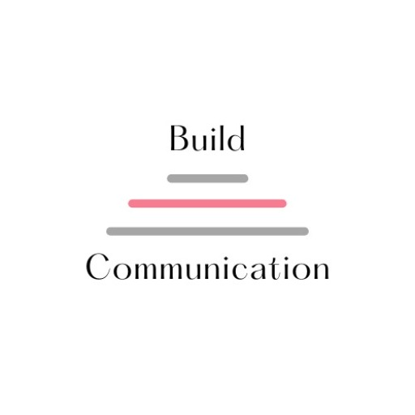

  

  Your journey to learn pronounciation starts here.

## Introduction
Build Communication provides an immersive experience for kids to develop and enhance their vocal as well as acoustic skills through interactive modules. The modules are divided on the basis of sounds each having different words with a similar sound in it. Each module is designed in such a way that once a kid completes a module than the kid becomes confident in pronouncing those type of words.

Have a look at our <a href="https://devpatel210.github.io/Website-for-Juniors/">website</a> and explore the modules.

## Features

* **Installable on multiple devices** - PWA Support
* **Fully responsive design** - Using media queries

## Modules

* **Abcdgenics** - Learn how to pronounce english alphabets in a gamified manner. Every time a randon alphabet is generated and the kid has to select the correct alphabet. If correct alphabet is selected the color changes to green else it turns to red.
  
  

* **Wordssster** - Kids learn how to pronounce similar sounding words through quiz. This module is divided into different sections each focusing on particular sound.
  
  
  
  

  
  
* **Wonder Speak** - The pronuncition of kids is tested in this module. The quiz contains different objects and the kid have to pronounce it.
  
  

## Built with

* HTML
* CSS
* Javascript
